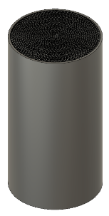

Welcome to my Engineering Cad Portfolio, below are my most impressive CAD projects.

# Catalytic Converter

This was for work with Incolmotos Yamaha in Colombia, we were tasked with improving the design and manufacture of the catalytic converter in their XTZ-125 model motorcycle, which was made with fully metal parts. We did this by changing the channel geometry to a triangular one, which optimized channel size and therefore airflow while maintaining surface area the same, and changing the base material to ceramic. Ceramic catalytic converters are used in cars, they're much cheaper to make. We found no evidence against using ceramic catalytic converters in motorcycles, it's not used much but they do exist mostly in India for some reason. In total, 3 channel geometries were devised (square, hexagonal, triangular), of which triangular proved to have the largest channel size, hence why it was chosen. Below are the designs created in the process, with supporting simulations further down. I also created a CAD replica of the original in order to run simulations. CADs were created with Autodesk Fusion 360, and simulations were done with ANSYS.

## CADs

### Original

